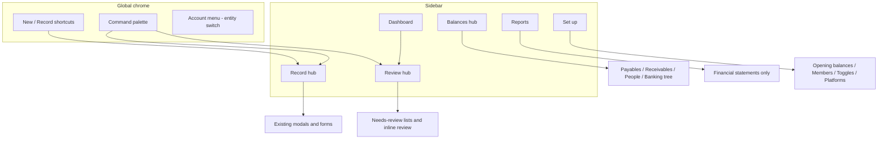

# UX / Information Architecture Audit — Mizan (proposal only)

**Date:** 2026-06-25  
**Scope:** Frontend navigation, quick actions, record flows, review surfaces, balances, reports, settings.  
**Constraint:** No booking-logic changes — navigation and placement only.  
**Status:** For owner review before any implementation.

This audit reflects the repo **as of Phase 12.5** (`app-routes.ts`, `nav-sections.ts`, `new-menu.tsx`, 47 app pages, 48 form components). Recent wins (grouped New menu, `/close-day`, `/banking/review`, section tabs) are acknowledged; the proposal builds on them rather than restarting.

---

## Executive summary

The app is **functionally complete** but **organized by backend domain** (POS, payables, banking, staff…) rather than by **what the owner does each day**: record money in/out, review what the system isn’t sure about, check who owes whom, and run reports.

The owner’s mental model is a **circle**:

```
Set up once → Record daily → Review exceptions → Check balances → Reports / tax
```

Today, **Record** is split across New menu (8 modals), dashboard buttons, section pages (Sales upload, Cards settlements, Delivery hub, Banking modals, People detail pages), and `/uploads`. **Review** is split across `/uploads`, `/sales`, `/banking/review`, supplier drafts, delivery reports, and dashboard “Needs review”. **Balances** are correct but scattered (Payables tab vs Suppliers detail, Receivables vs Customers, Staff/Partners sidebars with no summary tabs).

**Recommendation:** Collapse navigation into four top-level intents — **Record · Review · Balances · Reports** — plus **Set up**. Keep all existing forms and APIs; change shells, routes, and entry points only, with redirects for old URLs.

---

## 1. CURRENT MAP

### 1.1 Sidebar (primary nav)

Eight groups, 14 visible rows (`app-routes.ts` + `navGroups`). Several destinations are **hidden** (`SIDEBAR_HIDDEN_HREFS`) and reached only via **in-section tabs** or cards.

| Group | Sidebar link | Hidden tabs / children (same section) |
|-------|----------------|----------------------------------------|
| **Overview** | Dashboard `/` | — |
| **Sales** | Sales `/sales` | Card clearing `/cards`, Close day `/close-day` |
| **Sales** | Delivery `/delivery` | Platforms, Reports, Settlements |
| **Expenses & suppliers** | Expenses `/expenses` | — |
| **Expenses & suppliers** | Documents `/uploads` | — |
| **Expenses & suppliers** | Suppliers `/suppliers` | Payables `/payables` |
| **People** | Staff `/staff` | — |
| **People** | Partners `/partners` | — |
| **Customers** | Customers `/customers` | Receivables `/receivables` |
| **Cash & bank** | Banking `/banking` | Review `/banking/review`, Transfers, Cash drawer |
| **Reports** | Reports `/reports` | P&L, BS, CF, KDV, delivery sales, period comparison, **General ledger**, **Manual journals** |
| **Settings** | Settings `/settings` | Restaurant & toggles, Opening balances, Members, Expense items |

**Global chrome (not in sidebar):**

- **New** dropdown (`new-menu.tsx`) — grouped quick-action modals
- **Account menu** — entity switch, sign out
- **⌘K command palette** — navigates or opens same modals as New

**Delivery module:** When `delivery_enabled` is off, Delivery sidebar + New delivery report are hidden (`filterRoutesByEntitySettings`).

---

### 1.2 New menu & command palette (quick record)

| Group | Action | Opens |
|-------|--------|--------|
| **Operations** | Close day | Page `/close-day` (`DayCloseoutForm`) |
| **Sales** | Daily sales (manual) | Modal `ManualDailySalesForm` |
| **Sales** | POS summary (photo) | Modal `PosSummaryUploadForm` |
| **Sales** | Delivery report | Modal `DeliveryReportForm` (if delivery on) |
| **Expenses** | Manual expense | Modal `ManualExpenseForm` |
| **Expenses** | Expense receipt (photo) | Modal `ExpenseReceiptUploadForm` |
| **Cash & bank** | Buy foreign currency | Modal `FxPurchaseQuickAction` |
| **Suppliers** | Supplier (master) | Modal `SupplierForm` |
| **Suppliers** | Supplier invoice (e-Fatura) | Modal `EfaturaUploadForm` |

**Dashboard duplicates:** Daily sales, Add expense (modals), Close day (link).

---

### 1.3 Every recordable action — where it lives today

| Owner task | Primary entry | Alternate / duplicate entries |
|------------|---------------|-------------------------------|
| **Daily sales (typed)** | New → Daily sales | Dashboard button; Sales list empty hint |
| **Daily sales (POS photo)** | New → POS photo | Sales → Upload POS photo; `/uploads`; review → `/sales/[id]` |
| **Close day (sales + expenses)** | New → Close day | Dashboard link; `/close-day` tab under Sales |
| **Manual expense (cash)** | New → Manual expense | Dashboard; Expenses empty hint; Close day inline expenses |
| **Expense receipt (multi-line)** | New → Receipt photo | `/uploads`; review → `/review/receipts/[id]` |
| **Cash tip (5700)** | New → Manual expense (5700 preset) | Expenses page hint only |
| **Supplier master** | New → Supplier | Suppliers list → New supplier |
| **Supplier e-Fatura** | New → e-Fatura | `/uploads`; Supplier detail → Upload; review → `/review/invoices/[id]` or inline draft |
| **Supplier payment** | Supplier detail → Record payment | — (not in New) |
| **Card sales batch** | Cards tab → Record batch | — (not in New; rarely used if POS daily sales used) |
| **POS bank settlement** | Cards tab → Record settlement | — |
| **Commission clearance** | Cards tab → Clear commission | — |
| **Delivery report** | New → Delivery report | Delivery hub → Upload; `/uploads` |
| **Delivery settlement** | Delivery hub / Settlements tab | — |
| **Bank statement CSV** | Bank account detail → Upload | `/uploads` explains + links Banking |
| **Statement line classify** | Bank account statement review | **Unified** `/banking/review` |
| **Account transfer** | Banking → Transfers | Banking hub → New transfer |
| **Cash drawer movement** | Cash drawer page | — |
| **Cash drawer EOD close** | Cash drawer page | Close day (different — posts sales/expenses, not drawer count) |
| **Cash drawer day close / reopen** | Cash drawer page | Phase 11.13 |
| **Buy FX** | New → Buy FX | FX wallet page → Buy |
| **Convert FX** | FX wallet page only | — |
| **Spend FX** | FX wallet page only | — |
| **Staff: accrual / advance / payment** | Staff detail only | Staff list → New employee (master only) |
| **Partner: expense fronted** | Partner detail only | (11.7 unified expense — may be in manual expense now) |
| **Partner: reimbursement** | Partner detail only | — |
| **Customer: credit sale / payment** | Customer detail only | — |
| **Opening balances** | Settings → Opening balances | — |
| **Manual journal** | Reports → Manual journals | — |
| **Correct posted entries** | Per-list Correct buttons (expenses, sales, ledgers, supplier/customer/staff/partner/FX) | General ledger correct; statement review correct |

---

### 1.4 Review surfaces (post-upload / needs attention)

| Content type | List / hub | Drill-down review |
|--------------|------------|-------------------|
| POS daily summary | `/sales` (status filter implicit in list) | `/sales/[id]` |
| Expense receipt | — (no unified list) | `/review/receipts/[id]` |
| Supplier e-Fatura | Supplier detail drafts; `/uploads` links to suppliers | `/review/invoices/[id]`; inline on supplier |
| Bank/card statements | `/banking/review` (unified) | Per-line inline; `/banking/statements/[id]` legacy? |
| Delivery report | `/delivery/reports` | `/delivery/reports/[id]` |
| Dashboard aggregate | KPI “Needs review” count | Links vary |

---

### 1.5 Read-only / balance surfaces

| Surface | Route | Notes |
|---------|-------|-------|
| Payables summary | `/payables` | Links to supplier detail; no payment action here |
| Receivables summary | `/receivables` | Links to customer detail |
| Staff directory | `/staff` | Balance on detail only |
| Partners directory | `/partners` | Share % warning; balance on detail |
| Banking tree | `/banking` | Balances per account |
| FX wallet | `/banking/fx/[id]` | Native + TRY cost |
| Card clearing recon | `/cards` | In-transit / clearing balances |
| Delivery clearing recon | `/delivery` | Platform clearing |
| Expenses list | `/expenses` | Posted + correct |
| General ledger | `/reports/ledger` | All JEs |
| Financial statements | `/reports/*` | P&L, BS, CF, etc. |

---

### 1.6 Set up

| Item | Route |
|------|-------|
| Create restaurant, seed chart, toggles | `/settings/entity` |
| Opening balances | `/settings/opening-balances` |
| Members & roles | `/settings/members` |
| Expense item merge | `/settings/expense-items` |
| Delivery platforms | `/delivery/platforms` (not in Settings hub cards) |
| Money accounts (bank/cash/FX/card) | Banking → New account |
| Onboarding checklist | Dashboard widget |

---

### 1.7 Flags: scattered, duplicated, or “here for nothing”

| Issue | Detail |
|-------|--------|
| **Upload trinity** | Same four uploads in **New**, **`/uploads`**, and often again on **section pages** (Sales upload, Supplier upload, Delivery hub). |
| **Sales entry quadruplet** | Manual sales modal, POS photo modal, Close day page, Card batch form — overlapping purposes. |
| **People transactions invisible from New** | Salary, advance, partner fronted, customer sale — **must know** to open Staff/Partners/Customers first. |
| **FX convert/spend orphaned** | Only on FX wallet; buy is promoted in New. |
| **Card clearing under Sales** | Conceptually treasury/banking; owner may not look under Sales for bank deposits. |
| **Documents vs Expenses** | `/uploads` named “Documents” in nav but lives beside Expenses; receipt review not listed on `/uploads` review links. |
| **Reports overload** | Operational ledger + manual journals mixed with P&L/BS for accountants and owners alike. |
| **Payables/Receivables tabs** | Useful summaries but easy to miss (hidden from sidebar; tab under Suppliers/Customers). |
| **Settings / Delivery split** | Platforms live under Delivery, not Settings — inconsistent with “set up” mental model. |
| **Close day vs Cash drawer EOD** | Two different “close” concepts; naming collision risk. |

---

## 2. PROBLEMS (owner journey)

### 2.1 Daily record loop

1. Owner opens **New** for sales/expense — good.  
2. For **staff salary** or **partner paid for groceries**, must leave New → sidebar → person → detail → button. **No map from daily workflow.**  
3. **Bank deposit** after card sales: Sales → Cards tab (not New, not Banking).  
4. **Statement**: Banking → pick account → upload — or read `/uploads` then jump to Banking.  
5. **End of day**: three valid paths (Close day page, manual sales + expenses separately, POS photo + receipt photos) — **unclear which is canonical**.

### 2.2 Review loop

1. Dashboard shows **Needs review** count but not a single queue.  
2. `/uploads` “Review pending” links to **lists**, not **items** — owner still hunts.  
3. `/banking/review` is the best unified pattern (tabs + inline actions) — **not discoverable** from Documents or Dashboard.  
4. Expense receipts lack a **list page** equivalent to `/sales` for POS summaries.

### 2.3 Balance check loop

1. “How much do we owe suppliers?” → Payables tab (if owner knows) or Dashboard payables KPI.  
2. “How much does partner X front?” → Partners → drill — no partners **balance summary** page (unlike payables/receivables).  
3. Staff balances only on employee detail — no payroll **summary** view.

### 2.4 Inconsistencies

| Pattern | Inconsistent examples |
|---------|------------------------|
| **Record from New** | Expenses yes; staff/partner/customer no |
| **Record from list header** | Staff New employee; Sales Upload; Cards settlements |
| **Record from detail only** | Payments, accruals, FX convert |
| **Section tabs** | Sales, Banking, Suppliers, Customers, Settings, Delivery — **not** Staff, Partners, Expenses, Reports |
| **Naming** | “Documents” vs “Uploads”; “Sales” vs “Daily sales”; “Close day” vs “Close drawer” |

---

## 3. PROPOSED IA

### 3.1 Top-level structure (sidebar)

Replace eight domain groups with **five intents** (+ account chrome unchanged):

```
Overview          →  Dashboard (KPIs, onboarding, shortcuts)
Record            →  /record  (hub — all posting actions)
Review            →  /review  (unified queue — extend banking/review pattern)
Balances          →  /balances (subledgers + banking tree entry)
Reports           →  /reports  (financial statements + exports only)
Set up            →  /setup    (settings, masters, platforms, opening balances)
```

**Opinion:** Keep **⌘K** and a slim **New** button that opens `/record` or the same grouped menu — but **one canonical hub** so New isn’t the only discoverable record surface.

### 3.2 Record hub (`/record`)

Single page, **card grid by workflow** (not by backend module). Each card opens existing modal or navigates to existing full-page form. **No new APIs.**

| Section | Cards (existing components) |
|---------|-------------------------------|
| **Today** | Close day · Daily sales (manual) · Manual expense |
| **Upload & extract** | POS photo · Expense receipt · e-Fatura · Delivery report · Bank statement (→ pick account) |
| **Cash & FX** | Cash movement · Buy FX · Convert FX · Spend FX · Transfer |
| **Sales & cards** | Card sales batch · POS settlement · Clear commission *(advanced; collapsible)* |
| **Delivery** | Delivery report · Delivery settlement *(if module on)* |
| **People** | Staff accrual · Staff advance · Staff payment · Partner expense fronted · Partner reimbursement · Customer credit sale · Customer payment |
| **Suppliers** | New supplier · Record supplier payment |

**People cards** need a **person picker** step (reuse Combobox + existing detail forms) so owner doesn’t pre-navigate to `/staff/[id]`.

**Merge / remove:**

- **`/uploads`** → redirect to `/record#upload` (or fold into Record hub; drop duplicate upload grid).  
- **Dashboard** quick actions → stay as shortcuts but label “Same as Record → …”.  
- **Sales page “Upload POS photo”** → link to Record hub (keep list on `/sales` for history only).

### 3.3 Review hub (`/review`)

Extend **`/banking/review`** pattern to **all** intake types.

| Tab | Source | Existing UI to reuse |
|-----|--------|---------------------|
| **All needs review** | Aggregate API or client merge | New strip atop banking review |
| **Bank & card** | Statement lines | Current `/banking/review` |
| **Sales** | `pos/daily-summaries?status=needs_review` | Link to `/sales/[id]` |
| **Receipts** | `expense-receipts?status=…` | Link to `/review/receipts/[id]` |
| **Invoices** | `invoices/drafts?status=…` | Link to `/review/invoices/[id]` |
| **Delivery** | `delivery/reports?status=…` | Link to `/delivery/reports/[id]` |

**Dashboard “Needs review”** → links to `/review` with tab pre-selected.

**Remove:** `/uploads` “Review pending” link farm (replaced by Review hub).

### 3.4 Balances hub (`/balances`)

| Tab | Content | From |
|-----|---------|------|
| **Summary** | Payables total, Receivables total, Staff payable total (new aggregate if needed), Partner due total, TRY position | Dashboard APIs + payables/receivables |
| **Suppliers** | Current `/payables` table | Move here |
| **Customers** | Current `/receivables` table | Move here |
| **Staff** | Employee list + **balance column** (fetch per row or summary endpoint) | Enhance `/staff` |
| **Partners** | Partner list + balance column | Enhance `/partners` |
| **Cash & bank** | Link card → current `/banking` tree | Entry point only |

**Detail pages** (`/suppliers/[id]`, etc.) stay for ledger history + record payment — reached from Balances tables.

**Sales / Cards clearing:** Keep **operational recon** on Sales → Cards (or Balances → Card clearing sub-tab) — owner needs it near sales, but add cross-link from Balances → “Card money in transit”.

### 3.5 Reports (`/reports`)

**Split operational accounting from management reports:**

| Stay on `/reports` | Move to **Set up** or **Review** |
|--------------------|----------------------------------|
| P&L, Balance sheet, Cash flow | General ledger → **Review → Posted** or **Balances → Audit trail** |
| KDV input, Period comparison | Manual journals → **Record** (advanced) or **Set up → Accountant** |
| Delivery sales report | |

Rename card categories: **Management · Tax · Comparison** only.

### 3.6 Set up (`/setup`)

Merge Settings hub + master data entry points:

| Card | Current route |
|------|----------------|
| Restaurant & toggles | `/settings/entity` |
| Opening balances | `/settings/opening-balances` |
| Members | `/settings/members` |
| Expense items | `/settings/expense-items` |
| Delivery platforms | `/delivery/platforms` |
| Bank/cash/FX accounts | `/banking` (accounts section) |
| Suppliers / Staff / Partners / Customers directories | Optional links (masters also creatable from Record) |
| Backups (info) | Settings `#backups` |

**Sidebar “Settings”** becomes **Set up**; old `/settings` redirects.

### 3.7 Proposed navigation diagram



### 3.8 What we would **not** remove (only relocate)

- All **detail** pages and **correction** dialogs  
- **Close day** as a first-class daily driver (promote in Record → Today)  
- **Section tabs** inside Sales, Banking, Delivery — keep as **secondary** nav within Balances/Record drill-downs  
- **Cash drawer** session UI — stays under Banking/Cash; add link from Record → Cash movement  

---

## 4. SAFE MIGRATION PLAN

Phased so each step is shippable; **book behavior unchanged**.

### Phase UX-0 — Registry & redirects (1 slice)

| Step | Work | Breakage risk | Mitigation |
|------|------|---------------|------------|
| Add `UX_AUDIT_PROPOSAL.md` acceptance checklist to ROADMAP slice | Docs only | None | — |
| Introduce `route-aliases.ts` next to `nav-sections.ts` | Low | Single module for old→new paths |
| Add Next.js `redirect()` in `next.config` or thin middleware for `/uploads` → `/record` | Medium | Bookmarks, tests | Keep old routes working 1 release; `nav-sections.test.ts` + reachability test update |

**Tests:** `nav-sections.test.ts`, `app-routes.test.ts`, any E2E path assertions.

### Phase UX-1 — Record hub shell (1–2 slices)

| Step | Work | Risk | Mitigation |
|------|------|------|------------|
| New page `/record` — card grid wiring to **existing** `openQuickAction` + existing forms | Low | Duplicate with New menu | New menu items call same handlers; Record is discoverable |
| Add **person pickers** for staff/partner/customer actions (wrapper components) | Medium | Wrong `entity_id`, RLS | Reuse detail form props; test with `test_entity_isolation` patterns |
| Dashboard buttons → “Record” labels | Low | None | Copy only |

**Do not remove** New dropdown until owner sign-off.

### Phase UX-2 — Review hub expansion (2 slices)

| Step | Work | Risk | Mitigation |
|------|------|------|------------|
| Rename/route `/banking/review` → `/review` with **sub-routes** `/review/statements`, etc. | Medium | Deep links, Banking tabs | Redirect `/banking/review`; update `NAV_SECTIONS` banking tab |
| Add tabs for POS, receipts, invoices, delivery | Medium | Performance (N API calls) | Lazy-load per tab; reuse list endpoints |
| Dashboard Needs review → `/review` | Low | — | — |

**Dependencies:** List endpoints must support `status=needs_review` filters (mostly exist).

### Phase UX-3 — Balances hub (1–2 slices)

| Step | Work | Risk | Mitigation |
|------|------|------|------------|
| `/balances` with Payables + Receivables content moved | Low | Tab URLs | Redirect `/payables`, `/receivables` |
| Staff/Partner balance columns | Medium | N+1 queries | Optional lightweight summary API (read-only); or paginated |
| Sidebar: Suppliers/Customers/Staff/Partners → under Balances | Medium | Muscle memory | Keep redirects; update onboarding checklist links |

### Phase UX-4 — Reports cleanup (1 slice)

| Step | Work | Risk | Mitigation |
|------|------|------|------------|
| Move General ledger + Manual journals out of Reports card grid | Low | Accountant bookmark | Redirect cards; add under Review/Setup |
| Update `filterFinancialReportCards` for roles | Low | Cashier 403 | Already gated |

### Phase UX-5 — Set up consolidation (1 slice)

| Step | Work | Risk | Mitigation |
|------|------|------|------------|
| `/setup` hub = settings cards + link to Delivery platforms | Low | — | Redirect `/settings` |
| Sidebar label Settings → Set up | Low | — | — |

### Phase UX-6 — Deprecate duplicates (optional, post sign-off)

- Remove `/uploads` page content (redirect only)  
- Remove duplicate upload buttons on Sales/Delivery/Supplier headers (replace with “Record → …”)  
- Collapse `app-routes.ts` “New:” pseudo-routes into Record metadata  

### Cross-cutting safeguards

| Area | Guard |
|------|--------|
| **Auth / roles** | `shouldShowNewMenu`, `canWriteOperations`, `filterFinancialReportCards` — apply same gates on Record hub cards |
| **Feature toggles** | `delivery_enabled`, `card_tips_z_report_enabled` — hide cards, not routes |
| **Deep links** | Maintain redirects ≥ 6 months; document in CHANGELOG |
| **Components** | Do **not** fork forms — only new hub shells + picker wrappers |
| **Backend** | No posting changes; optional read-only aggregate endpoints for Balances summary |
| **Tests** | Extend `REGISTERED_PAGE_ROUTES`; add reachability test for new hubs; smoke: one post per Record card |

---

## 5. RISKS & OPEN QUESTIONS

### 5.1 Owner decisions required

| # | Question | Options | Recommendation |
|---|----------|---------|----------------|
| Q1 | **Canonical daily sales path** | (A) Close day only (B) Close day + POS photo for Z (C) Keep all three | **B** — Close day for simple days; POS photo when Z tracking on |
| Q2 | **Card batch / settlement** | Hide under “Advanced” vs drop from Record hub | **Advanced** collapsible — still needed without daily sales |
| Q3 | **General ledger visibility** | Reports vs Review vs Balances | **Review → All posted** for owner; **Setup → Accountant tools** for manual journals |
| Q4 | **People payments from Record** | Require person picker vs force detail page | **Person picker** on Record hub |
| Q5 | **Sidebar breadth** | 5 items vs keep domain sidebar + hubs | **5 items** — domain pages become tabs inside hubs |
| Q6 | **Rename “Documents”** | Drop in favor of Record | **Yes** — `/uploads` goes away |
| Q7 | **Partner expense from manual expense** | Unified form (11.7) vs partner-only on Record | **Single Manual expense** with payment mode — Record hub one card |

### 5.2 Technical risks

| Risk | Severity | Note |
|------|----------|------|
| Redirect churn breaks owner bookmarks | Medium | Permanent redirects + CHANGELOG |
| Review hub load time (many APIs) | Medium | Tab lazy load; server-side aggregate later |
| Staff/partner balance N+1 | Low | Phase UX-3 optional API |
| Command palette route duplication | Low | Generate palette from Record hub metadata |
| Parallel agents editing `nav-sections.ts` | High | Single IA slice owner; gate in ROADMAP |

### 5.3 Out of scope for this IA pass

- Document **searchable archive** (Decisions §7) — future module  
- **Period locks** admin UI  
- **Bank feed** — post-launch  
- Changing **double-entry** or correction rules  
- Mobile-native layout (proposal assumes desktop-first restaurant office)

### 5.4 Success metrics (post-migration)

- Owner can record **any** transaction type starting from **one** hub in ≤ 2 clicks  
- **Needs review** items reachable from Dashboard in 1 click  
- New owner onboarding checklist references **Set up** and **Record** only  
- Zero regression in pytest + frontend build; no change in GL posting tests  

---

## Appendix A — Route inventory (47 pages)

| Route | Kind | Proposed home |
|-------|------|----------------|
| `/` | Dashboard | Overview |
| `/record` | **NEW hub** | Record |
| `/review` | **NEW hub** (expand banking/review) | Review |
| `/balances` | **NEW hub** | Balances |
| `/setup` | **NEW hub** (alias settings) | Set up |
| `/sales`, `/sales/[id]` | List + review | Review (list) + history under Sales tab |
| `/close-day` | Full page form | Record → Today |
| `/cards` | Operations | Balances → Card clearing or Sales tab |
| `/delivery/*` | Module | Set up (platforms) + Record + Review |
| `/expenses` | List | Balances or Review (posted) |
| `/uploads` | Duplicate hub | **Deprecate** → Record |
| `/suppliers`, `/suppliers/[id]` | Master + ledger | Balances + Set up |
| `/payables` | Summary | Balances tab |
| `/staff`, `/staff/[id]` | Master + ledger | Balances + Record |
| `/partners`, `/partners/[id]` | Master + ledger | Balances + Record |
| `/customers`, `/customers/[id]` | Master + ledger | Balances + Record |
| `/receivables` | Summary | Balances tab |
| `/banking/*` | Tree + ops | Balances + Record |
| `/reports/*` | Statements | Reports |
| `/reports/ledger` | Audit | Review or Setup |
| `/accounting/manual-journals` | Accountant | Setup → Accountant |
| `/settings/*` | Config | Set up |
| `/review/receipts/[id]`, `/review/invoices/[id]` | Drill review | Review |
| `/sign-in`, `/sign-up` | Auth | — |

---

## Appendix B — Form component index (48 forms)

All remain unchanged; only **call sites** move to Record/Review/Balances hubs.

**Today / sales:** `manual-daily-sales-form`, `day-closeout-form`, `pos-summary-upload-form`, `correct-daily-sales-form`  
**Expenses:** `manual-expense-form`, `expense-receipt-upload-form`, `correct-expense-form`  
**Suppliers:** `supplier-form`, `efatura-upload-form`, `supplier-payment-form`, `correct-supplier-*`  
**Banking:** `statement-upload-form`, `transfer-form`, `money-account-form`, `cash-movement-form`, `cash-drawer-close-form`, `cash-drawer-close-day-form`  
**FX:** `fx-purchase-form`, `fx-conversion-form`, `fx-expense-spend-form`, `correct-fx-*`  
**POS/cards:** `card-sales-form`, `pos-settlement-form`, `clear-commission-form`  
**Delivery:** `delivery-report-form`, `delivery-settlement-form`, `delivery-platform-form`  
**People:** `employee-form`, `staff-accrual-form`, `staff-cash-movement-form`, `partner-form`, `partner-expense-fronted-form`, `partner-reimbursement-form`, `customer-form`, `customer-credit-sale-form`, `customer-payment-form`, `correct-*-ledger-form`  
**Accounting:** `void-manual-journal-dialog`, `correct-ledger-entry-form`  
**Admin:** `member-form`  

---

*End of proposal. Review with owner before creating ROADMAP Phase UX slices.*
